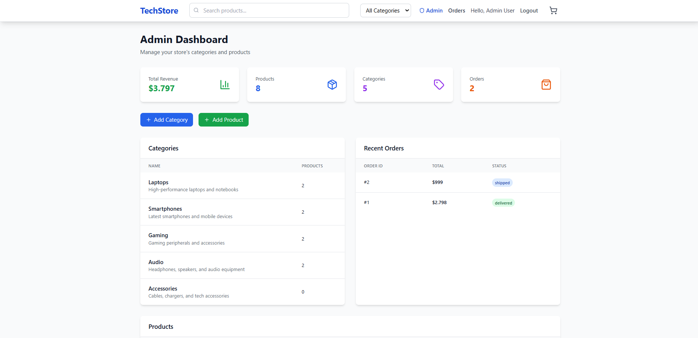
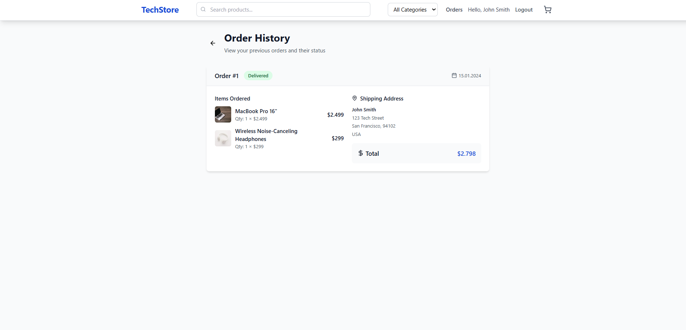

# E-Commerce Website

Bu proje, **Teknolojik ürünler satan bir e-ticaret sitesi** için geliştirilmiştir.  
Sadece admin (yönetici) tarafından ürün eklenebilirken, kullanıcılar ürünleri sepete ekleyip sipariş verebilir.  
Site, örnek verilerle (mock data) doldurulmuştur.

---

## 🚀 Başlangıç

### 📥 Projeyi Klonlama

Projeyi bilgisayarınıza klonlamak için aşağıdaki komutu kullanabilirsiniz:

```bash
git clone https://github.com/Kerimcan19/E-Commerce-Website.git
```
---
⚙️ Kurulum

Projeyi kurmak için aşağıdaki adımları izleyin:

Gerekli bağımlılıkları yüklemek için:
```bash
npm install
```

Projeyi başlatmak için:
```bash
npm run dev
```
Bu adımlar, projeyi yerel geliştirme ortamınızda çalıştıracaktır.

---

🛠️ Kullanılan Teknolojiler

Frontend: React, Tailwind CSS

Backend: FastAPI

Veritabanı: PostgreSQL

Diğer Araçlar: Vite, TypeScript

---

👤 Kullanıcı Hesapları
Admin (Yönetici)

E-posta: admin@example.com

Şifre: 123456

Admin, yeni kategori ve ürünler ekleyebilir.

Kullanıcı

E-posta: user@example.com

Şifre: 123456

Kullanıcı, ürünleri sepete ekleyebilir ve sipariş verebilir.

---

📸 Ekran Görüntüleri



